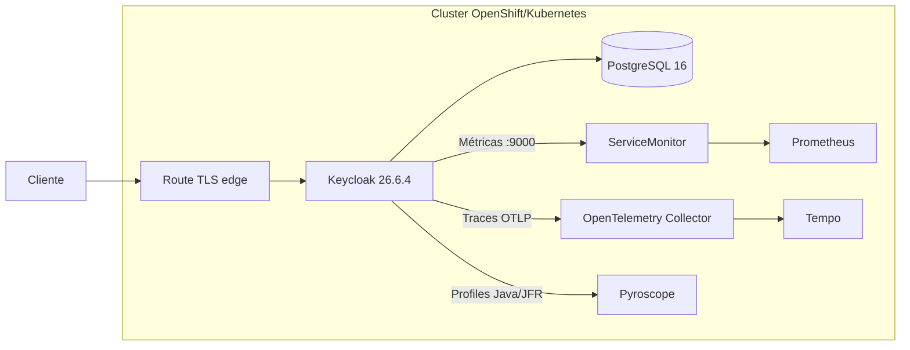

# Keycloak GitOps

Implantação declarativa do **Keycloak 26.6.4** em OpenShift, preparada para
laboratórios locais com PostgreSQL, métricas, alertas, traces OpenTelemetry e
profiles no Pyroscope. Os overlays `desenvolvimento`, `aceite` e `producao`
isolam nomes, rotas e telemetria com Kustomize.

> Este projeto usa o Keycloak comunitário e seu Operator oficial. Ele não é o
> Red Hat Build of Keycloak (RHBK), que possui outro ciclo de suporte.

## Arquitetura



- Operator e CRDs oficiais fixados em `26.6.4`, evitando atualização implícita.
- Porta de gerenciamento `9000` acessível somente dentro do cluster.
- métricas de eventos limitadas por realm para controlar cardinalidade;
- histogramas e exemplares OpenMetrics habilitados;
- amostragem de traces em 20% com `traceidratio`;
- profiles Java/JFR enviados ao Pyroscope para o Grafana Profiles Drilldown;
- imagem otimizada pelo `kc.sh build`, criada pelo GitHub Actions;
- recursos dimensionados para OpenShift Local, sem promessa de alta disponibilidade.

## Estrutura

```text
base/                 recursos comuns, Operator, banco e observabilidade
docker/Dockerfile     build otimizado e extensível do Keycloak
themes/               JARs opcionais de temas/providers (não versionados)
overlays/{desenvolvimento,aceite,producao} nomes e hosts de cada ambiente
docs/                documentação operacional por ambiente
```

## Pré-requisitos

- OpenShift 4.x com `oc`, Kustomize e permissão `cluster-admin`;
- Prometheus Apps, OpenTelemetry Collector, Tempo e Pyroscope implantados pela
  stack GitOps;
- imagem `quay.io/thiagobotelho/rhbk-keycloak-custom:26.6.4-pyroscope-2.8.0`
  publicada.

O deploy funciona sem Tempo/Pyroscope, mas traces/profiles não aparecerão no
Grafana enquanto os backends não estiverem disponíveis.

## Build da imagem

O workflow publica a imagem no Quay em pushes para `main`. Para testar localmente:

```bash
podman build \
  --build-arg KEYCLOAK_VERSION=26.6.4 \
  --build-arg PYROSCOPE_JAVA_AGENT_VERSION=2.8.0 \
  -t quay.io/thiagobotelho/rhbk-keycloak-custom:26.6.4-pyroscope-2.8.0 \
  -f docker/Dockerfile .
```

Providers e temas devem ser JARs em `themes/` antes do build. O Dockerfile
normaliza timestamps, executa `kc.sh build` e adiciona
`/opt/keycloak/pyroscope.jar` para ativar profiling via `JAVA_OPTS_APPEND`.

## Deploy

Crie o segredo no namespace escolhido; nenhum segredo real deve entrar no Git:

```bash
export ENVIRONMENT=desenvolvimento
export NAMESPACE=keycloak-dev
export KEYCLOAK_NAME=keycloak-dev

oc create namespace "${NAMESPACE}" --dry-run=client -o yaml | oc apply -f -
oc -n "${NAMESPACE}" create secret generic keycloak-db-secret \
  --from-literal=username=keycloak \
  --from-literal=password="$(openssl rand -base64 32)" \
  --from-literal=database=keycloak \
  --dry-run=client -o yaml | oc apply -f -
scripts/bootstrap-observability-users.sh

oc apply -k "overlays/${ENVIRONMENT}"
oc -n "${NAMESPACE}" wait --for=condition=Ready keycloak/${KEYCLOAK_NAME} --timeout=10m
```

O Job `keycloak-config-cli-observability` cria o realm `observability`, grupos,
usuários e clients para Grafana e Zabbix. Ele consome o Secret
`keycloak-observability-users` no namespace do Keycloak:

| Chave | Uso |
|---|---|
| `GRAFANA_ADMIN_PASSWORD` | senha inicial do usuário `grafana-admin` |
| `ZABBIX_ADMIN_PASSWORD` | senha inicial do usuário `zabbix-admin` |
| `OBSERVABILITY_ADMIN_PASSWORD` | senha inicial do usuário `observability-admin` |

Criação idempotente:

```bash
cp .env.example .env
# opcional: preencha as senhas; se ficarem vazias, o script gera valores fortes.
scripts/bootstrap-observability-users.sh
```

Rotação: altere as variáveis no `.env` e reexecute o script; depois sincronize
o app no Argo CD para recriar o Job de configuração do realm.

### Clients de autenticação

- `grafana`: OpenID Connect confidential client; URL base vem da variável
  `GRAFANA_BASE_URL` injetada pelo overlay.
- `zabbix`: SAML client; URL base vem da variável `ZABBIX_BASE_URL` injetada
  pelo overlay.

O client secret do Grafana fica no Keycloak e deve ser exportado para o Secret
`grafana/grafana-oauth` pelo repositório `grafana-gitops`; ele não é versionado.

Confira a renderização antes da sincronização:

```bash
oc kustomize overlays/desenvolvimento >/tmp/keycloak-dev.yaml
oc apply --dry-run=server -f /tmp/keycloak-dev.yaml
```

## Observabilidade

O endpoint OTLP padrão é
`otel-collector-collector.observability.svc:4317`. O `ServiceMonitor` força
OpenMetrics para preservar exemplares e o Grafana pode ligar uma amostra de
latência ao trace correspondente no Tempo.

O profiling contínuo usa o Pyroscope Java Agent em modo JFR, com baixo acoplamento
ao container:

| Variável | Valor padrão | Uso |
|---|---|---|
| `JAVA_OPTS_APPEND` | `-javaagent:/opt/keycloak/pyroscope.jar` | carrega o agente Java |
| `PYROSCOPE_SERVER_ADDRESS` | `http://pyroscope.pyroscope.svc:4040` | endpoint interno do Pyroscope |
| `PYROSCOPE_APPLICATION_NAME` | definido por overlay | nome exibido no Profiles Drilldown |
| `PYROSCOPE_FORMAT` | `jfr` | formato necessário para perfis Java ricos |
| `PYROSCOPE_PROFILER_TYPE` | `JFR` | usa profiler nativo da JVM |
| `PYROSCOPE_PROFILER_EVENT` | `cpu` | evita o default `itimer`, que pode falhar em JFR no CRC |
| `PYROSCOPE_LABELS` | definido por overlay | labels `service_name`, `service_namespace`, `namespace` e ambiente |

Esses labels precisam continuar alinhados ao datasource Tempo do
`grafana-gitops`, que mapeia `service.name` para `service_name` ao abrir
profiles a partir de um trace.

As métricas de eventos ficam restritas a login, logout, registro e erros. Não
adicione `clientId` ou `idp` indiscriminadamente: esses rótulos podem elevar
muito a cardinalidade. Os dashboards oficiais de capacidade e troubleshooting
são provisionados pelo repositório `grafana-gitops`.

Validação rápida:

```bash
oc -n "${NAMESPACE}" get keycloak,pods,route,servicemonitor,prometheusrule
oc -n "${NAMESPACE}" port-forward svc/keycloak-${ENVIRONMENT}-service 9000:9000
curl -fsS http://127.0.0.1:9000/health/ready
curl -fsS http://127.0.0.1:9000/metrics | head
oc -n "${NAMESPACE}" exec "${KEYCLOAK_NAME}-0" -- printenv PYROSCOPE_APPLICATION_NAME
```

## Segurança e produção

- substitua PostgreSQL local por banco gerenciado e backups testados;
- use External Secrets ou Sealed Secrets e política de rotação;
- troque a Route edge por TLS reencrypt/passthrough quando houver requisito
  ponta a ponta;
- fixe imagens por digest após homologação;
- ajuste réplicas, requests, limites, PDB, anti-affinity e amostragem;
- não exponha as portas `9000`, `4317`, `4318` ou o banco externamente;
- revise CVEs e notas de versão antes de alterar a versão fixada.

## Atualização

Atualize em conjunto a versão dos manifests oficiais em `base/kustomization.yaml`,
`KEYCLOAK_VERSION`/`PYROSCOPE_JAVA_AGENT_VERSION` no workflow/Dockerfile e a tag
em `base/keycloak.yaml`. Renderize os três overlays e teste primeiro em
`desenvolvimento`.

Referências: [Keycloak Guides](https://www.keycloak.org/guides),
[observabilidade](https://www.keycloak.org/observability/telemetry) e
[containers](https://www.keycloak.org/server/containers). Para profiling,
consulte a documentação do
[Pyroscope Java Agent](https://grafana.com/docs/pyroscope/latest/configure-client/language-sdks/java/).

## Ambientes e validação

```bash
oc kustomize overlays/desenvolvimento >/tmp/keycloak-dev.yaml
oc kustomize overlays/aceite >/tmp/keycloak-aceite.yaml
oc kustomize overlays/producao >/tmp/keycloak-prod.yaml
oc apply --dry-run=client -k overlays/desenvolvimento
```

`desenvolvimento` usa hosts CRC. `aceite` e `producao` usam placeholders
`.example.invalid`; substitua no `configMapGenerator` antes do sync. Mais
detalhes em `docs/AMBIENTES.md`.

## Licença

[MIT](LICENSE)
