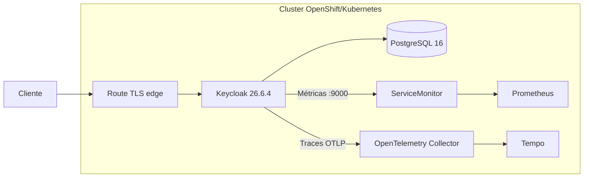

# Keycloak GitOps

Implantação declarativa do **Keycloak 26.6.4** em OpenShift, preparada para
laboratórios locais com PostgreSQL, métricas, alertas e traces OpenTelemetry.
Os overlays `dev`, `uat` e `prd` isolam nomes, rotas e telemetria com Kustomize.

> Este projeto usa o Keycloak comunitário e seu Operator oficial. Ele não é o
> Red Hat Build of Keycloak (RHBK), que possui outro ciclo de suporte.

## 🏗️ Arquitetura



- Operator e CRDs oficiais fixados em `26.6.4`, evitando atualização implícita.
- Porta de gerenciamento `9000` acessível somente dentro do cluster.
- métricas de eventos limitadas por realm para controlar cardinalidade;
- histogramas e exemplares OpenMetrics habilitados;
- amostragem de traces em 20% com `traceidratio`;
- imagem otimizada pelo `kc.sh build`, criada pelo GitHub Actions;
- recursos dimensionados para OpenShift Local, sem promessa de alta disponibilidade.

## Estrutura

```text
base/                 recursos comuns, Operator, banco e observabilidade
docker/Dockerfile     build otimizado e extensível do Keycloak
themes/               JARs opcionais de temas/providers (não versionados)
overlays/{dev,uat,prd} nomes e hosts de cada ambiente
```

## Pré-requisitos

- OpenShift 4.x com `oc`, Kustomize e permissão `cluster-admin`;
- User Workload Monitoring habilitado;
- OpenTelemetry Collector e Tempo para receber traces;
- imagem `quay.io/thiagobotelho/rhbk-keycloak-custom:26.6.4` publicada.

O deploy funciona sem Tempo, mas o Collector registrará falhas de exportação.

## Build da imagem

O workflow publica a imagem no Quay em pushes para `main`. Para testar localmente:

```bash
podman build \
  --build-arg KEYCLOAK_VERSION=26.6.4 \
  -t quay.io/thiagobotelho/rhbk-keycloak-custom:26.6.4 \
  -f docker/Dockerfile .
```

Providers e temas devem ser JARs em `themes/` antes do build. O Dockerfile
normaliza timestamps e executa `kc.sh build`, como recomendado pelo Keycloak.

## Deploy

Crie o segredo no namespace escolhido; nenhum segredo real deve entrar no Git:

```bash
export ENVIRONMENT=dev
export NAMESPACE=keycloak-${ENVIRONMENT}

oc create namespace "${NAMESPACE}" --dry-run=client -o yaml | oc apply -f -
oc -n "${NAMESPACE}" create secret generic keycloak-db-secret \
  --from-literal=username=keycloak \
  --from-literal=password="$(openssl rand -base64 32)" \
  --from-literal=database=keycloak \
  --dry-run=client -o yaml | oc apply -f -

oc apply -k "overlays/${ENVIRONMENT}"
oc -n "${NAMESPACE}" wait --for=condition=Ready keycloak/keycloak-${ENVIRONMENT} --timeout=10m
```

Confira a renderização antes da sincronização:

```bash
oc kustomize overlays/dev >/tmp/keycloak-dev.yaml
oc apply --dry-run=server -f /tmp/keycloak-dev.yaml
```

## Observabilidade

O endpoint OTLP padrão é
`otel-collector-collector.observability.svc:4317`. O `ServiceMonitor` força
OpenMetrics para preservar exemplares e o Grafana pode ligar uma amostra de
latência ao trace correspondente no Tempo.

As métricas de eventos ficam restritas a login, logout, registro e erros. Não
adicione `clientId` ou `idp` indiscriminadamente: esses rótulos podem elevar
muito a cardinalidade. Os dashboards oficiais de capacidade e troubleshooting
são provisionados pelo repositório `grafana-gitops`.

Validação rápida:

```bash
oc -n "${NAMESPACE}" get keycloak,pods,route,servicemonitor,prometheusrule
oc -n "${NAMESPACE}" port-forward svc/keycloak-${ENVIRONMENT}-service 9000:9000
curl -fsS http://127.0.0.1:9000/health/ready
curl -fsS http://127.0.0.1:9000/metrics | head
```

## Segurança e produção

- substitua PostgreSQL local por banco gerenciado e backups testados;
- use External Secrets ou Sealed Secrets e política de rotação;
- troque a Route edge por TLS reencrypt/passthrough quando houver requisito
  ponta a ponta;
- fixe imagens por digest após homologação;
- ajuste réplicas, requests, limites, PDB, anti-affinity e amostragem;
- não exponha as portas `9000`, `4317`, `4318` ou o banco externamente;
- revise CVEs e notas de versão antes de alterar a versão fixada.

## Atualização

Atualize em conjunto a versão dos três manifests oficiais em
`base/kustomization.yaml`, `KEYCLOAK_VERSION` no workflow/Dockerfile e a tag em
`base/keycloak.yaml`. Renderize os três overlays e teste primeiro em `dev`.

Referências: [Keycloak Guides](https://www.keycloak.org/guides),
[observabilidade](https://www.keycloak.org/observability/telemetry) e
[containers](https://www.keycloak.org/server/containers).

## Licença

[MIT](LICENSE)
